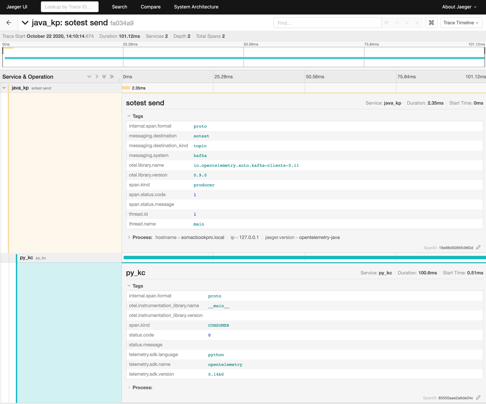

# OTEL_Kafka

## Prereq

* Download https://github.com/open-telemetry/opentelemetry-java-instrumentation
* Setup Kafka
  * The scripts assume Kafka is running at timemachine:9094. Please change it to your broker host and port
  * The script assumes it has 'sotest' topic with 3 partitions (0-2)
* Setup Jaeger

## How to run

### java_kp (publisher)

```sh
cd java_kp/src
./gradlew bootJar
java -javaagent:$HOME/Downloads/opentelemetry-javaagent-all.jar -Dotel.exporter=jaeger -Dotel.exporter.jaeger.endpoint=timemachine:14250 -Dotel.exporter.jaeger.service.name=java_kp -jar build/libs/java_kp-1.0-SNAPSHOT.jar
```

### java_kc (consumer)

```sh
cd java_kc/src
./gradlew bootJar
java -javaagent:$HOME/Downloads/opentelemetry-javaagent-all.jar -Dotel.exporter=jaeger -Dotel.exporter.jaeger.endpoint=timemachine:14250 -Dotel.exporter.jaeger.service.name=java_kc -jar build/libs/java_kc-1.0-SNAPSHOT.jar
```

### py_kc (consumer)

```sh
pip install -r requirements.txt
python py_kc.py
```

## Output examples

* When you run java_kp with OTEL Java Instrumentation, you can see that it injects *traceparent* and 00-_traceid_-01 as below
* *Java Instrumentation* uses the same format as WC3 *traceparent* specified at <https://www.w3.org/TR/trace-context/#examples-of-http-traceparent-headers>
  * traceparent = b'00-4bf92f3577b34da6a3ce929d0e0e4736-00f067aa0ba902b7-01' (byte array in Python) means,
  * version = 00
  * trace-id = 4bf92f3577b34da6a3ce929d0e0e4736
  * parent-span-id = 00f067aa0ba902b7
  * trace-flags = 01  // sampled

```sh
# java_kc prints like this
t:sotest, p:0, o:55, value:[2020-10-21 16:33:15.35] hello - 99
 k:traceparent, v_str:00-9920de194a30697156a48197035ea02f-ee6777ba42d62dda-01, v_hex:0x30302d39393230646531393461333036393731353661343831393730333565613032662d656536373737626134326436326464612d3031
...
# py_kc prints like this
[2020-10-22 05:10:04.671057] msg:ConsumerRecord(topic='sotest', partition=0, offset=966, timestamp=1603343404671, timestamp_type=0, key=None, value=b'[2020-10-22 14:10:04.67] hello - 73', headers=[('traceparent', b'00-9749f59d118d9592c1a5a8311feb56cc-e37adb3b69cac1cf-01')], checksum=None, serialized_key_size=-1, serialized_value_size=35, serialized_header_size=66)
k:traceparent, v_hex:30302d39373439663539643131386439353932633161356138333131666562353663632d653337616462336236396361633163662d3031
tid:201097446668802158671425316767436330700, sid:16391654841992790479
context:{'current-span': <opentelemetry.trace.span.DefaultSpan object at 0x7f1e0d478a00>}
span:_Span(name="py_kc", context=SpanContext(trace_id=0x9749f59d118d9592c1a5a8311feb56cc, span_id=0x48ba11348793ee35, trace_state=0, is_remote=False))
------------------------------
...
```

* When you run java_kp with *Brave Kafka Interceptor*, it injects X-B3-TraceId,X-B3-SpanId,X-B3-Sampled as below. Format is differnt from above.

```sh
[2020-10-22 12:32:26.782771] msg:ConsumerRecord(topic='sotest', partition=0, offset=1119, timestamp=1603369946793, timestamp_type=0, key=None, value=b'[2020-10-22 21:32:26.791] hello - 03', headers=[('X-B3-TraceId', b'5f917bdaaac71b911c1592bcde9f784f'), ('X-B3-SpanId', b'1c1592bcde9f784f'), ('X-B3-Sampled', b'1')], checksum=None, serialized_key_size=-1, serialized_value_size=36, serialized_header_size=84)
k:X-B3-TraceId, v_hex:3566393137626461616163373162393131633135393262636465396637383466
k:X-B3-SpanId, v_hex:31633135393262636465396637383466
k:X-B3-Sampled, v_hex:31
No tid or/and sid
------------------------------
```

* Jaeger trace stitching example. *traceparent* injected by *Java Instrumentation* in java_kp is nicely stitched with py_kc.



## Notes

### Quick Kafka config with Docker

```sh
git clone https://github.com/wurstmeister/kafka-docker.git

# edit docker-compose-single-broker.yml as below
# please change ${YOUR DOCKER HOST IP} with your docker host's IP (e.g 192.168.1.2)
version: '2'
services:
  zookeeper:
    image: wurstmeister/zookeeper
    ports:
      - "2181:2181"
  kafka:
    build: .
    ports:
      - "9092:9092"
      - "9094:9094"
    environment:
      KAFKA_ADVERTISED_LISTENERS: INSIDE://:9092,OUTSIDE://${YOUR DOCKER HOST IP}:9094
      KAFKA_LISTENERS: INSIDE://:9092,OUTSIDE://:9094
      KAFKA_LISTENER_SECURITY_PROTOCOL_MAP: INSIDE:PLAINTEXT,OUTSIDE:PLAINTEXT
      KAFKA_INTER_BROKER_LISTENER_NAME: INSIDE

      KAFKA_CREATE_TOPICS: "sotest:3:1"
      KAFKA_ZOOKEEPER_CONNECT: zookeeper:2181
    volumes:
      - /var/run/docker.sock:/var/run/docker.sock


```
